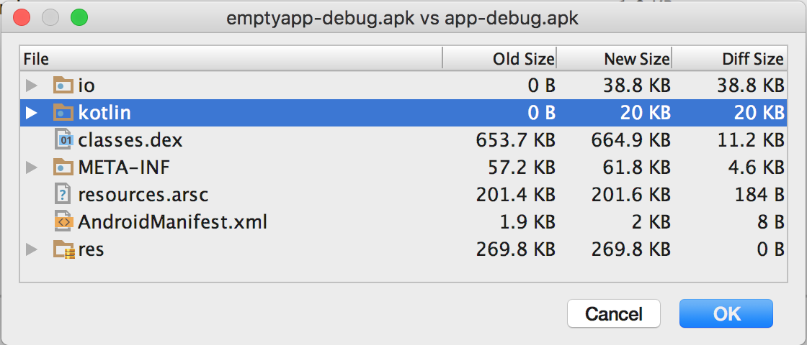

# Komparison

*This repo was made because of this [Reddit Discussion](https://www.reddit.com/r/androiddev/comments/5s2l9u/last_pager_adapter_dont_write_a_viewpager_adapter/)*

Size impact comparison between an APK using Kotlin based library ([LastPagerAdapter](https://github.com/rakshakhegde/LastPagerAdapter/)) vs an APK from off-the-shelf Empty App from Android Studio.
 
 Empty App has no reference to the LastPagerAdapter library or Kotlin.
 
 App has reference to just LastPagerAdapter which in turn refers to Kotlin.
 
 Here lie the thousand words:
 
 
 
 On Proguarding, Kotlin library's size took up just 20kb extra even though the original Kotlin stdlib is 300kb. That's because I barely use any of Kotlin's stdlib functions in LastPagerAdapter.
 
 And `io` refers to my actual library code. It has databinding + custom API, logic, which takes up ~39kb.
 
 On the whole just LastPagerAdapter takes up an extra space of ~78kb. It'll be even lesser if you're already using Kotlin + Databinding.